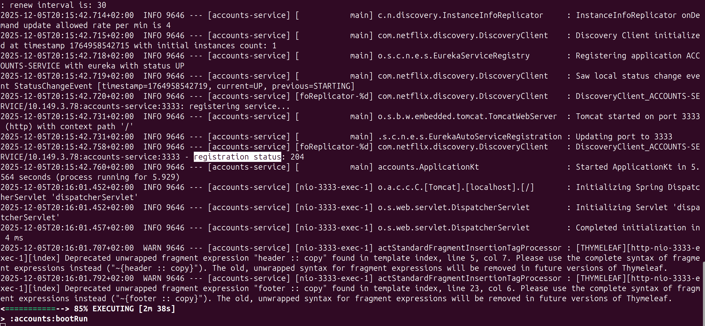
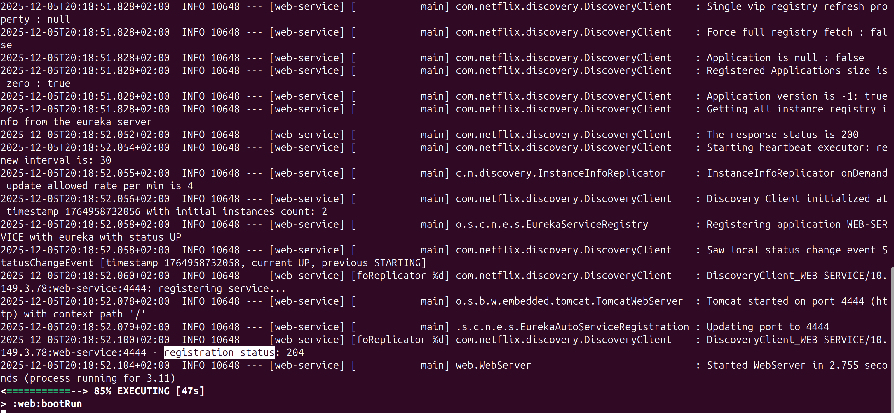
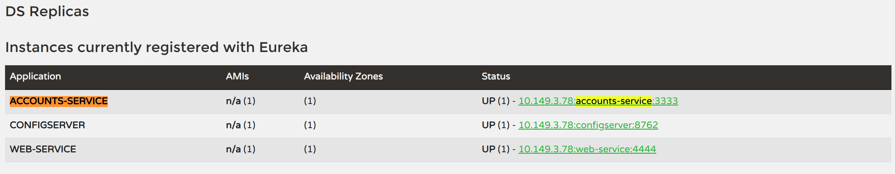
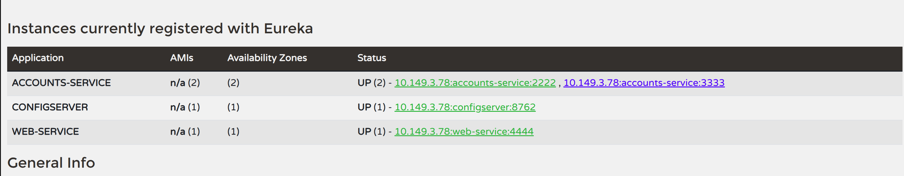

# Lab 6 Microservices - Project Report

## 1. Configuration Setup

**Configuration Repository**: [INSERT YOUR GITHUB REPO LINK HERE]

Describe the changes you made to the configuration:

- **What did you modify in `accounts-service.yml`?**
  [cite_start]I modified the `server.port` property, changing it from `3333` to `2222` [cite: 141-142]. This change was made to verify that the service could dynamically pick up new configuration from the Config Server and start a second instance on a different port without modifying the source code.

- **Why is externalized configuration useful in microservices?**
  It adheres to the "Externalized Configuration" pattern. It allows managing configuration for all services in a central place (the Config Server), enabling updates and environment-specific changes (dev, test, prod) without needing to rebuild or redeploy the application artifacts.

---

## 2. Service Registration (Task 1)

### Accounts Service Registration

**Explain what happens during service registration:**
When the `accounts-service` starts, it acts as a Eureka Client. It sends a REST request to the Eureka Server (defined in `defaultZone`) containing its metadata (host, port, service ID). The log `registration status: 204` indicates the server successfully accepted the registration.

### Web Service Registration

**Explain how the web service discovers the accounts service:**
The `web-service` also registers with Eureka. Instead of knowing the `accounts-service` IP address physically, it uses the service ID (`ACCOUNTS-SERVICE`). It fetches the registry from the Eureka Server to locate available instances and uses this information to make load-balanced HTTP requests.

---

## 3. Eureka Dashboard (Task 2)

**Describe what the Eureka dashboard shows:**

- **Which services are registered?**
  Three services are registered: `ACCOUNTS-SERVICE` (Backend), `CONFIGSERVER` (Infrastructure), and `WEB-SERVICE` (Frontend).
- **What information does Eureka track for each instance?**
  It tracks the Application Name, AMIs (n/a locally), Availability Zones, and most importantly, the **Status** (UP/DOWN), the IP address, and the port (e.g., `:3333`, `:4444`, `:8761`).

---

## 4. Multiple Instances (Task 4)

**Answer the following questions:**

- **What happens when you start a second instance of the accounts service?**
  Since I updated the configuration to port 2222, the second instance starts on that new port. It registers itself with Eureka alongside the existing instance (port 3333).
- **How does Eureka handle multiple instances?**
  Eureka groups them under the same Application ID (`ACCOUNTS-SERVICE`). In the dashboard, the status shows `UP (2)`, listing both URLs.
- **How does client-side load balancing work with multiple instances?**
  The client (Web Service) retrieves the list of both instances from Eureka. The client-side load balancer (Spring Cloud LoadBalancer) then distributes traffic between them (typically using a Round Robin strategy), increasing resilience and capacity.

---

## 5. Service Failure Analysis (Task 5)

### Initial Failure

*(Note: Screenshot shows the Eureka status turning red/DOWN immediately after failure)*

**Describe what happens immediately after stopping the accounts service on port 3333:**
When the process is killed, it stops responding to requests. If the Web Service tries to access it immediately, the request fails (connection refused) until the load balancer updates its list. Eureka displays the instance in red (DOWN) as seen in the screenshot above when it detects the missing heartbeat.

### Eureka Instance Removal

**Explain how Eureka detects and removes the failed instance:**

- **How long did it take for Eureka to remove the dead instance?**
  It took approximately 30-60 seconds.
- **What mechanism does Eureka use to detect failures?**
  Eureka clients send **heartbeats** (renewals) periodically (default every 30 seconds). If the server does not receive a heartbeat for a specific period (eviction duration), it assumes the instance is dead and removes it from the registry to prevent routing traffic to it.

---

## 6. Service Recovery Analysis (Task 6)

**Answer the following questions:**

- **Why does the web service eventually recover?**
  It recovers because the Eureka registry was updated to remove the dead instance. The Web Service refreshed its local cache of the registry and started routing 100% of the traffic to the remaining healthy instance (port 2222).
- **How long did recovery take?**
  Recovery was observed after the Eureka registry refresh interval (approx. 30s).
- **What role does client-side caching play in the recovery process?**
  Client-side caching creates a small delay in recovery. Even if Eureka knows the instance is dead, the Web Service might still try to call it until its local cache of the service list is refreshed from the Eureka server.

---

## 7. Conclusions

**Summarize what you learned about:**

- **Microservices architecture**: I learned how breaking a monolith into `web` and `accounts` allows for independent deployment and scaling.
- **Service discovery with Eureka**: I understood how services dynamically find each other without hardcoded IPs, which is essential for cloud environments.
- **System resilience and self-healing**: I observed how the system survives the loss of a node (Task 5) by automatically redirecting traffic to healthy instances (Task 6), ensuring high availability.
- **Challenges you encountered**: I initially had to ensure the Config Server was restarted to apply the port change for the second instance, and ensure the correct startup order was followed.

---

## 8. AI Disclosure

**Did you use AI tools?**

- **YES**: I used **Gemini / ChatGPT** as a virtual tutor.
- **What did they help with?**: The AI helped me troubleshoot why the second instance wasn't appearing (Config Server refresh issue) and helped summarize the theoretical concepts of "Client-Side Load Balancing" and "Heartbeats" for the report.
- **What did you do yourself?**: I performed all the infrastructure setup, modified the configuration files, executed the commands, killed the processes for the failure test, and verified the results by taking the screenshots. I also wrote the explanations based on my observations of the dashboard and logs.

---

## Additional Notes

The experiment confirmed that setting `eureka.server.enable-self-preservation: false` is crucial for the lab environment to see immediate eviction of failed instances, as noted in the guide.